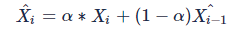
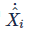

English| [简体中文](./README_cn.md)

# Feature Introduction

This filtering algorithm package uses the `OneEuroFilter` filtering strategy to smooth points and boxes, which is used to correct the positions of detection boxes and keypoint data such as human bodies, faces, and hands in perception results, and to fix the jitter issues of boxes and points.

# Installation Method

```bash
sudo apt update
sudo apt install -y tros-tros-lowpass-filter
```

# Usage

Launch the node using launch:

```bash
ros2 launch tros_lowpass_filter low_pass.launch.py
```

After startup, the node subscribes to the [hobot_msgs/ai_msgs/msg/PerceptionTargets](https://github.com/D-Robotics/hobot_msgs/blob/develop/ai_msgs/msg/PerceptionTargets.msg) type of topic messages. Based on the detection boxes and keypoint types in the messages, it automatically selects the corresponding filtering parameters to smooth all detection boxes and keypoints in the messages, and publishes the smoothed [hobot_msgs/ai_msgs/msg/PerceptionTargets](https://github.com/D-Robotics/hobot_msgs/blob/develop/ai_msgs/msg/PerceptionTargets.msg) type of topic messages.

# Interface Description

## Topics

| Name                  | Message Type       | Description                              |
| ---------------------- | ----------------- | ---------------------------------------- |
| /tros_perc_render     | [hobot_msgs/ai_msgs/msg/PerceptionTargets](https://github.com/D-Robotics/hobot_msgs/blob/develop/ai_msgs/msg/PerceptionTargets.msg)     | Published information after filtering |
| /tros_perc_fusion     | [hobot_msgs/ai_msgs/msg/PerceptionTargets](https://github.com/D-Robotics/hobot_msgs/blob/develop/ai_msgs/msg/PerceptionTargets.msg)   | Subscribed information before filtering |

## Parameters

| Parameter Name        | Type           | Explanation                                  | Required | Supported Configurations | Default Value                              |
| ---------------------- | -------------- | -------------------------------------------- | -------- | ----------------------- | ---------------------------------------- |
| config_file           | std::string    | Filtering parameter configuration file       | No       | Recommended to use default configuration | Path to params/low_pass.json under the installation of tros_lowpass_filter |
| perc_pub_topic        | std::string    | Topic name for publishing filtered information | No       | Configure according to actual deployment environment | /tros_perc_render |
| perc_sub_topic        | std::string    | Topic name for subscribing to unfiltered information | No       | Configure according to actual deployment environment | /tros_perc_fusion |

# Configuration Instructions

It is recommended to use the default filtering parameters. You need to modify the filtering parameters in the following two cases:

1. Fine-tuning jitter and delay effects.

The `beta` in the filtering configuration parameters is used to reduce delay, the larger the value, the smaller the delay in tracking the target by the box/point.

`mincutoff` is used to reduce jitter, the smaller the value, the smaller the jitter of the box/point.

2. Adding new filtering categories.

The `types` in the configuration specifies the filtering parameters for categories such as `"face", "face_kps", "hand", "hand_kps", "head", "body", "body_kps", "default"`. If the category of the box/point is not within `"face", "face_kps", "hand", "hand_kps", "head", "body", "body_kps"`, then use the parameters of the default `"default"` category.

Users can also add filtering parameters for new categories.

# Filtering Principle

In the process of de-noising, filtering is a common method, but there is a balance issue between jitter and delay in filtering. Taking the first-order low-pass filter as an example:



When α is relatively small, it can play a good filtering role, and sudden changes can be well eliminated, so the resistance to jitter is relatively strong. However, when our signal changes normally, due to the relationship with the α coefficient, it will cause the change of the filtered signal to lag, and the smaller the α, the more serious this lag is - which is the delay problem.

One Euro Filter addresses the issues of jitter and lag by proposing an improved, adaptive low-pass filter.

When the signal changes are not drastic, people are more sensitive to jitter, so a smaller α is used to minimize jitter.

When the signal changes are drastic, people are more sensitive to delay, so a larger α is used to allow the filtered signal to quickly track the original signal changes and reduce delay.

The specific method is as follows:
In the RC circuit system, the relationship between the time constant τ and the cutoff frequency fc is as follows:


The signal sampling period is Te, so we define α as:


Then, according to the low-pass filter formula, as fc decreases, τ increases, and α decreases, which can better eliminate jitter; conversely, it can reduce lag.
So, we can achieve adaptive adjustment by dynamically adjusting fc. One Euro Filter defines:


Where  is the gradient of the original signal (two samples divided by the sampling period), and then passes through a low-pass filter, where the cutoff frequency of this low-pass filter is fixed, which can avoid a large gradient and cause jitter:


Here, αd is obtained under a fixed cutoff frequency f.

We find that α is positively correlated with fc, positively correlated with anti-lag, and negatively correlated with anti-jitter.
When our system signal X changes drastically, it will cause fc to increase, thus increasing α, making the system tilt towards anti-lag;
When our system signal X changes slightly, it will cause fc to decrease, thus decreasing α, making the system tilt towards anti-jitter.
Through the above steps, the system completes the adaptive process.
