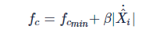

[English](./README.md) | 简体中文

# 功能介绍

本滤波算法功能包采用`OneEuroFilter`滤波策略对点和框做平滑操作，用于对感知结果中的人体、人脸、人手等检测框和关键点数据进行位置纠正，修复框和点的抖动问题。

# 安装方法

```bash
sudo apt update
sudo apt install -y tros-tros-lowpass-filter
```

# 使用方法

使用launch启动节点：

```bash
ros2 launch tros_lowpass_filter low_pass.launch.py
```

启动后，节点订阅[hobot_msgs/ai_msgs/msg/PerceptionTargets](https://github.com/D-Robotics/hobot_msgs/blob/develop/ai_msgs/msg/PerceptionTargets.msg)类型的话题消息，根据消息中检测框和关键点类型，自动选择对应的滤波参数，对消息中的所有检测框和关键点做平滑，发布经过平滑后的[hobot_msgs/ai_msgs/msg/PerceptionTargets](https://github.com/D-Robotics/hobot_msgs/blob/develop/ai_msgs/msg/PerceptionTargets.msg)类型的话题消息。

# 接口说明

## 话题

| 名称                 | 消息类型        | 说明|
| ---------------------- | ----------- |---------------------------- |
| /tros_perc_render     | [hobot_msgs/ai_msgs/msg/PerceptionTargets](https://github.com/D-Robotics/hobot_msgs/blob/develop/ai_msgs/msg/PerceptionTargets.msg)     | 发布的经过滤波后的信息 |
| /tros_perc_fusion          | [hobot_msgs/ai_msgs/msg/PerceptionTargets](https://github.com/D-Robotics/hobot_msgs/blob/develop/ai_msgs/msg/PerceptionTargets.msg)   | 订阅的滤波前的信息 |

## 参数

| 参数名                 | 类型        | 解释                                        | 是否必须 | 支持的配置           | 默认值                        |
| ---------------------- | ----------- | ------------------------------------------- | -------- | -------------------- | ----------------------------- |
| config_file    | std::string | 滤波参数配置文件             | 否       | 推荐使用默认配置    | tros_lowpass_filter安装路径下的params/low_pass.json           |
| perc_pub_topic | std::string | 发布经过滤波后的信息的topic名 | 否       | 根据实际部署环境配置 | /tros_perc_render |
| perc_sub_topic | std::string | 订阅的滤波前的信息的topic名   | 否       | 根据实际部署环境配置 | /tros_perc_fusion     |

# 配置说明

推荐使用默认的滤波参数，在以下两种情况下需要修改滤波参数：

1. 微调抖动和延迟效果。

滤波配置参数中的`beta`用于降低延迟，值越大，框/点跟踪目标的延迟越小。

`mincutoff`用于降低抖动，值越小，框/点抖动越小。

2. 新增滤波类别。

配置中`types`指定了`"face", "face_kps", "hand", "hand_kps", "head", "body", "body_kps", "default"`类别的滤波参数，如果框/点的类别不在`"face", "face_kps", "hand", "hand_kps", "head", "body", "body_kps"`范围内，则使用默认的`"default"`类别的参数。

用户也可以为新的类别添加滤波参数。

# 滤波原理

在去抖动过程中，滤波是一种常见方法，但是滤波会存在一个抖动和延迟平衡的问题，以一阶低通滤波器为例：


当α比较小的时候可以起到比较好的滤波作用，突变值可以很好被消除，所以对抖动的抵抗能力就比较强。但是当我们的信号正常变化的时候，由于α系数的关系，会导致滤波后的信号的变化出现滞后，并且α越小，这种滞后就越严重——这也就是延迟问题。

One Euro Filter就是针对jitter(抖动)和lag(延迟)的问题，提出了一种改进的，自适应的低通滤波器。

当信号变化的不剧烈的时候，大家对抖动比较敏感，使用比较小的α，这样可以尽量减小抖动。

当信号变化比较剧烈的时候，大家对延迟比较敏感，就使用较大的α，这样可以让滤波信号快速跟踪上原始信号变化，减小延迟。

具体方法如下：
RC电路系统中，时间常数time constant τ和截断频率cutoff frequency fc之间的关系如下：


信号的采样周期为Te，那么我们定义α为：


然后根据低通滤波公式，随着fc减小，τ会增大，α减小，这样可以比较好的消除jitter；反之，可以减小lag。
所以我们可以通过动态调节fc来达到自适应调节的功能，one euro filter定义了



其中是原始信号的梯度（两次采样除以采样周期），再经过一次低通滤波，这里的低通滤波的截止频率是固定的，这样可以避免梯度非常大，而导致抖动：


这里的αd是在固定截止频率f的情况下得到的。

这里我们发现α和fc成正常相关，α和防lag成正相关，和防jitter成负相关。
当我们的系统信号X变化较剧烈时，会导致fc变大，从而α增大，使系统向防lag一方倾斜；
当我们的系统信号X变化很小时，会导致fc变小，从而α减小，使系统向防jitter一方倾斜。
通过以上步骤，系统完成了自适应的过程。

